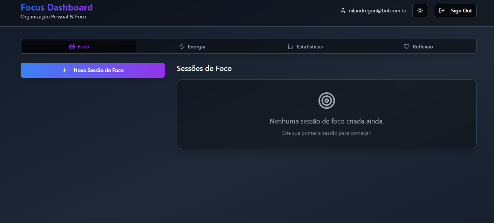

# 🎯 Focus Dashboard - Organização Pessoal & Foco
<p align="center">
  <!-- Licença -->
  
</p>

<div align="center">
  
</div>

## 📋 Sobre o Projeto
O **Focus Dashboard** é uma aplicação de produtividade pessoal construída com foco em **gestão de tempo, monitoramento de energia e reflexão diária**. A partir de técnicas comprovadas de organização pessoal, a plataforma oferece ferramentas para criar blocos de foco, acompanhar níveis de energia ao longo do dia e desenvolver o hábito da reflexão estruturada.

Este projeto une a potência do **Lovable** com **Supabase** para entregar uma **experiência completa de produtividade** com dados seguros e em tempo real.

## ⚙️ Funcionalidades Principais
* 🎯 Criação e gestão de blocos de foco personalizados
* ⚡ Monitoramento de níveis de energia com gráficos interativos
* 📊 Estatísticas detalhadas de produtividade e progresso
* 💭 Sistema de reflexão diária estruturada
* 🌙 Modo escuro/claro com persistência de preferência
* 🔐 Autenticação segura com Supabase Auth
* 📱 Design responsivo e glassmorphism

## 🛠 Tecnologias Utilizadas
* **Lovable** (IDE AI-driven com deploy instantâneo)
* **React + TypeScript**
* **Supabase** (Backend-as-a-Service)
* **Tailwind CSS**
* **shadcn/ui**
* **Vite**
* **React Query** (Gerenciamento de estado)
* **React Router** (Navegação)
* **Recharts** (Visualização de dados)

## 📂 Estrutura do Projeto
```
├── src/
│   ├── components/             # Componentes reutilizáveis
│   │   ├── ui/                # Componentes shadcn/ui
│   │   ├── Dashboard.tsx      # Dashboard principal
│   │   ├── FocusBlock.tsx     # Bloco de foco individual
│   │   ├── EnergyChart.tsx    # Gráfico de energia
│   │   └── ThemeToggle.tsx    # Alternador de tema
│   ├── pages/                 # Páginas da aplicação
│   │   ├── Index.tsx          # Página inicial
│   │   ├── Auth.tsx           # Autenticação
│   │   └── NotFound.tsx       # 404
│   ├── contexts/              # Contextos React
│   │   ├── AuthContext.tsx    # Contexto de autenticação
│   │   └── ThemeContext.tsx   # Contexto de tema
│   ├── hooks/                 # Hooks customizados
│   │   └── useSupabaseData.ts # Hook para dados do Supabase
│   ├── integrations/          # Integrações externas
│   │   └── supabase/          # Configuração Supabase
│   └── lib/                   # Utilitários
├── supabase/                  # Schema e migrações
└── README.md                  # Documentação do projeto
```

## 🧭 Guia de Implementação
### 🔹 Usando o Lovable (recomendado)
1. Acesse o projeto em [Lovable](https://lovable.dev/projects/f94e507b-e37e-4929-8521-09341a40a464)
2. Use prompts para personalizar suas funcionalidades
3. Publique via **Share > Publish**

### 🔹 Localmente com VSCode
```bash
git clone 
cd focus-dashboard
npm install
npm run dev
```

## 🗄️ Estrutura do Banco de Dados
O projeto utiliza **Supabase** com as seguintes tabelas:

* `profiles` - Perfis dos usuários
* `focus_blocks` - Blocos de foco criados pelos usuários
* `energy_levels` - Registros de níveis de energia
* `daily_reflections` - Reflexões diárias estruturadas

Todas as tabelas possuem **Row Level Security (RLS)** habilitado para garantir que usuários acessem apenas seus próprios dados.

## 🎯 Como Usar
### 📝 Criando Blocos de Foco
1. Acesse a aba **Foco**
2. Preencha o título, duração e categoria
3. Opcionalmente, defina um horário específico
4. Clique em **Adicionar Bloco de Foco**
5. Marque como concluído quando finalizar

### ⚡ Monitorando Energia
1. Vá para a aba **Energia**
2. Registre seu nível atual (1-10)
3. Acompanhe o gráfico de evolução ao longo do dia
4. Use os dados para otimizar seu cronograma

### 📊 Visualizando Estatísticas
* Taxa de conclusão de tarefas
* Distribuição por categorias
* Tendências de energia
* Métricas de produtividade

### 💭 Reflexão Diária
1. Acesse a aba **Reflexão**
2. Preencha os campos estruturados:
   - Conquistas do dia
   - Desafios enfrentados
   - Gratidão
   - Metas para amanhã
   - Avaliação do humor (1-10)

## 🔐 Autenticação
O sistema utiliza **Supabase Auth** com:
* ✅ Cadastro via email/senha
* ✅ Login seguro
* ✅ Recuperação de senha
* ✅ Proteção de rotas
* ✅ Logout automático

## 🌙 Temas
* **Modo Claro**: Interface limpa com tons suaves
* **Modo Escuro**: Reduz fadiga visual em ambientes com pouca luz
* **Persistência**: Sua preferência é salva automaticamente

## 💪 Como Contribuir
1. Faça um fork deste repositório
2. Crie uma branch: `git checkout -b feature/nova-funcionalidade`
3. Commit: `git commit -m 'feat: adiciona timer pomodoro'`
4. Push: `git push origin feature/nova-funcionalidade`
5. Abra um Pull Request

## 📝 Nota
Este projeto nasceu como uma ferramenta para **prototipagem acelerada**, focado em criadores, devs solo e entusiastas de narrativas interativas. Combinando IA, automação e design centrado na criatividade, o **IdeaForge Nexus** é seu ponto de partida para transformar ideias em realidades jogáveis.

<br>

---

<p align="center">
  Desenvolvido com ☕ por <a href="https://github.com/seuUsuario">Ricardo Andreotti Gonçalves</a> 🧑‍💻
</p>
